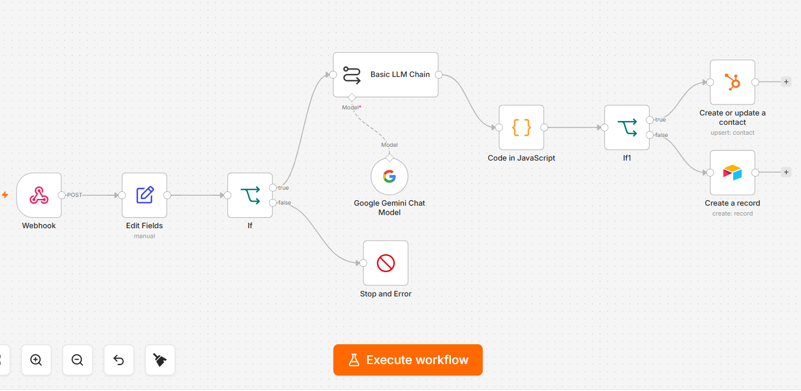
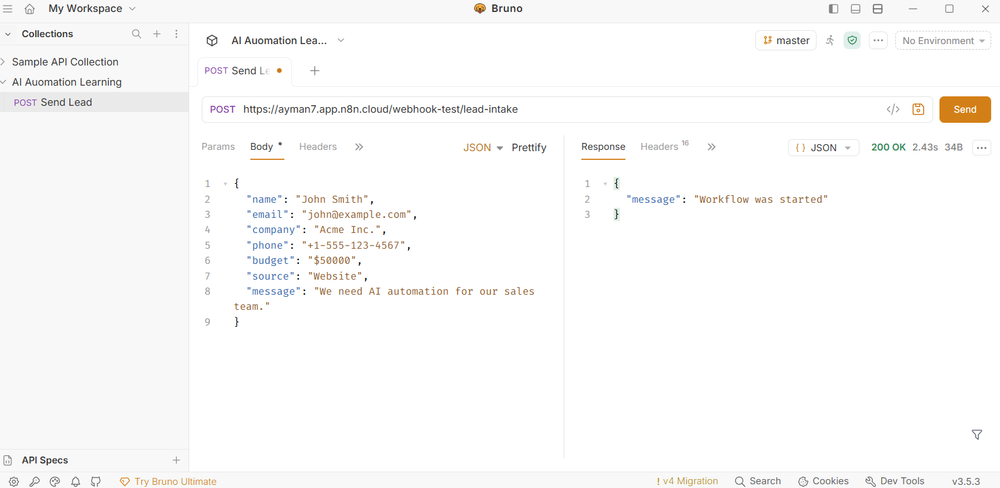
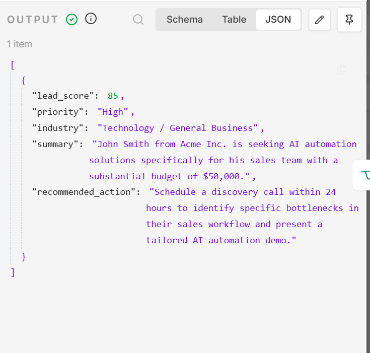
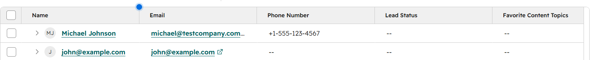
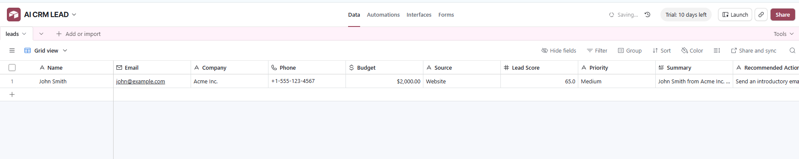

# AI CRM Automation

An AI-powered CRM automation built with **n8n**, **Google Gemini**, **HubSpot CRM**, **Airtable**, and **Webhooks**.

## Overview

This workflow automatically receives website leads, validates the data, uses AI to qualify each lead, routes high-priority leads to HubSpot, and stores lower-priority leads in Airtable.

## Features

- Webhook-based lead intake
- AI lead qualification using Google Gemini
- Lead scoring
- Conditional routing
- HubSpot CRM integration
- Airtable logging
- API testing with Bruno

## Workflow

```
Website Form
      │
      ▼
Webhook
      │
      ▼
Validate Lead
      │
      ▼
Gemini AI
      │
      ▼
Lead Score
     / \
 High  Low
  |      |
HubSpot  Airtable
```

## Screenshots

### Workflow Overview



---

### Webhook Test with Bruno



---

### AI Lead Qualification (Gemini)



---

### HubSpot Contact Created



---

### Airtable Record


## Tech Stack

- n8n
- Google Gemini API
- HubSpot CRM
- Airtable
- Bruno
- Webhooks

## Business Problem

Sales teams often waste time reviewing every incoming lead manually.

This automation uses AI to analyze each lead, assign a score, and automatically route qualified leads into HubSpot while logging lower-priority leads to Airtable.

## Skills Demonstrated

- AI Automation
- CRM Automation
- REST API Integration
- Webhooks
- Data Validation
- Conditional Logic
- JSON Data Handling
- Prompt Engineering

## Future Improvements

- Slack notifications
- Gmail follow-up emails
- Duplicate lead detection
- Multi-stage lead scoring
- GoHighLevel integration
