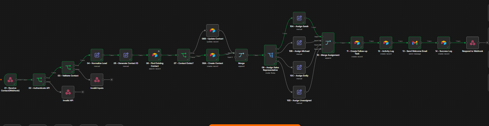
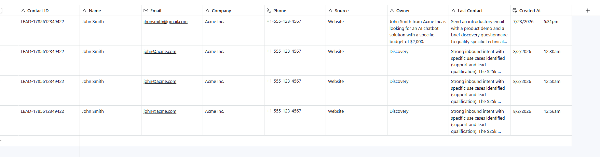
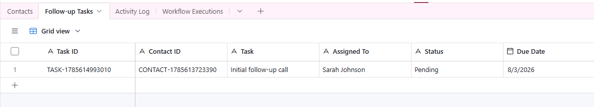
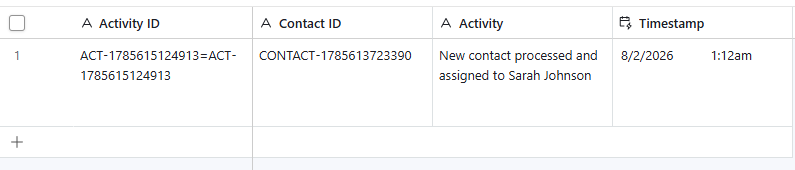
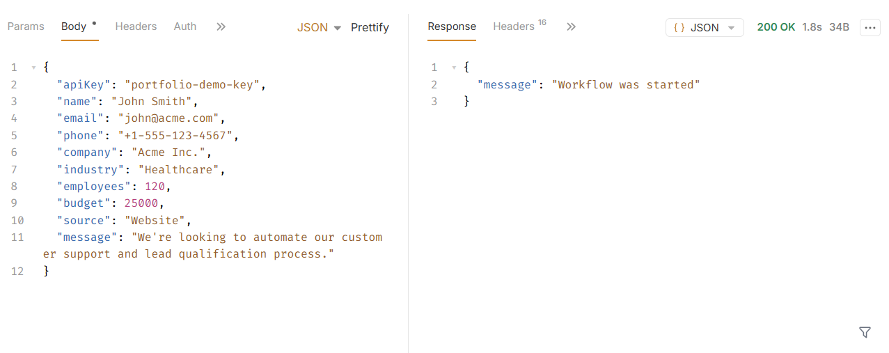

# 🚀 AI CRM Automation System

A production-ready CRM automation workflow built with **n8n**, **Airtable**, **Gmail**, and **Webhooks**.

This workflow automatically manages customer contacts, prevents duplicate records, assigns sales representatives, creates follow-up tasks, sends welcome emails, and logs every workflow execution.

---

## ✨ Features

- API Key Authentication
- Webhook API
- Input Validation
- Contact Normalization
- Automatic Contact ID Generation
- Duplicate Contact Detection
- Create or Update Contact
- Sales Representative Assignment
- Automatic Follow-up Task Creation
- Welcome Email Automation
- Activity Logging
- Workflow Execution Logging
- JSON API Response

---

## 🛠 Tech Stack

- n8n
- Airtable
- Gmail
- Webhooks
- JavaScript

---

## 📊 Workflow

```text
Webhook
    │
Authenticate API
    │
Validate Request
    │
Normalize Contact
    │
Generate Contact ID
    │
Find Existing Contact
    │
Contact Exists?
  ┌───────────────┐
  │               │
Create        Update
Contact       Contact
  └───────┬───────┘
          │
Assign Sales Representative
          │
Create Follow-up Task
          │
Log Activity
          │
Send Welcome Email
          │
Log Workflow Execution
          │
Respond to Webhook
```

---

## 📥 Sample Request

```json
{
  "apiKey": "portfolio-demo-key",
  "name": "John Smith",
  "email": "john@acme.com",
  "phone": "+1-555-123-4567",
  "company": "Acme Inc.",
  "industry": "Healthcare",
  "source": "Website",
  "message": "We are interested in CRM automation."
}
```

---

## 📤 Sample Response

```json
{
  "success": true,
  "contactId": "CRM-1785609560445",
  "assignedTo": "Sarah Johnson",
  "message": "Contact processed successfully."
}
```

---

## 🗂 Airtable Structure

### Contacts

- Contact ID
- Name
- Email
- Phone
- Company
- Industry
- Source
- Status
- Owner
- Last Contact
- Created At

### Follow-up Tasks

- Task ID
- Contact ID
- Task
- Due Date
- Assigned To
- Status

### Activity Log

- Activity ID
- Contact ID
- Activity
- Timestamp

### Workflow Executions

- Execution ID
- Workflow
- Status
- Message
- Timestamp

---

## 📸 Screenshots


### Complete n8n workflow



### Contacts table



### Follow-up Tasks table



### Activity Log



### Successful webhook response




---

## 🎥 Demo

Suggested 60–90 second demo:

1. Send a webhook request.
2. Show duplicate detection.
3. Show contact creation/update.
4. Show sales rep assignment.
5. Show follow-up task creation.
6. Show welcome email.
7. Show workflow execution log.

---

## 💼 Business Value

This workflow helps sales teams by:

- Eliminating duplicate contacts
- Automating CRM updates
- Assigning leads to the appropriate sales representative
- Creating follow-up tasks automatically
- Reducing manual administrative work
- Maintaining a complete activity history

---

## 📄 License

MIT
